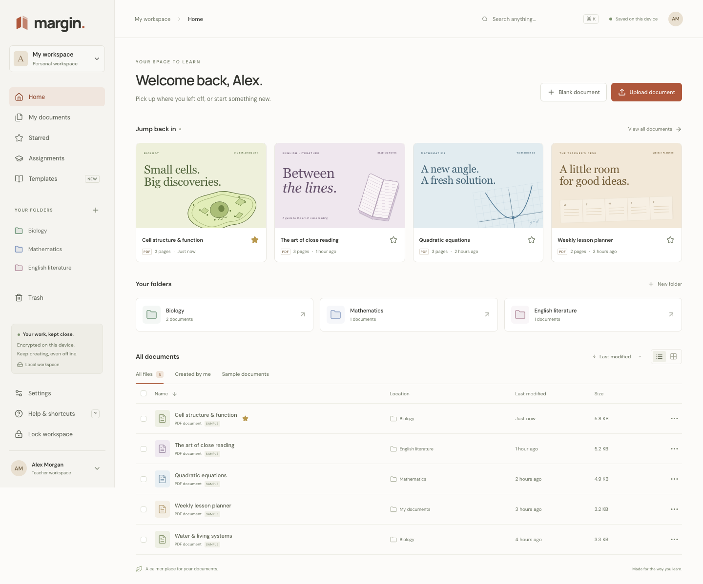

# Margin

**Room for your ideas.** A calm document workspace for reading, annotating and teaching, with a lightweight Chrome extension.

Margin takes its name from the place where questions, sketches and discoveries begin. The original visual direction combines warm paper, terracotta and restrained document tools. [Design references](docs/DESIGN.md) were inspected through the connected Mobbin MCP; the supplied Kami research informed the requirements.

This is a runnable local foundation. It includes real PDF editing, encrypted browser persistence, encrypted exports and a tested HTTPS upload service. Printed-English OCR runs locally on individual pages. Cloud identity, multi-user collaboration and school integrations are not provisioned. See the [release gates](docs/PRODUCTION_READINESS.md).



## Run locally

Requires Node.js 22+, npm and OpenSSL.

```sh
npm ci
npm run setup:dev
# On macOS, approve trust for this local server certificate:
npm run trust:dev
npm run dev
```

Open **https://127.0.0.1:5173**. Setup creates a 30-day self-signed server certificate and random API secrets under the Git-ignored `.local/` directory, with private file permissions. It never changes certificate trust or prints secrets. The certificate cannot act as a certificate authority.

On macOS, `npm run trust:dev` requests SSL trust for that exact server-only certificate in your user login keychain. The certificate names only `127.0.0.1`; its hostname and non-CA constraints preserve that limited scope. Approve the macOS prompt yourself. The helper imports only the public certificate, preserves normal certificate validation, and does not change system-wide trust. `npm run check:tls` checks native macOS verification; `npm run untrust:dev` reverses it. Reload the preview after approval. Other operating systems need their own development-certificate trust setup.

Always use **127.0.0.1**, not `localhost` or `::1`: the certificate intentionally does not cover those alternative names, and browser storage belongs to an exact origin. Chromium ignores macOS hostname-policy trust restrictions, so setup enforces the address in the certificate itself. For an older certificate/trust setup, run `npm run untrust:dev`, `npm run setup:dev`, then `npm run trust:dev`, and restart the development server. No certificate-error bypass is used. See [the trust boundary and source](docs/LOCAL_SECURITY.md).

Create a strong workspace passphrase. Documents and metadata are encrypted in this browser's IndexedDB. The passphrase is never stored or sent to the API. **There is no passphrase reset.** Keep it safely: it is also needed to open exported `.margin` packages in another workspace. Lock the workspace from the sidebar when finished, especially on shared devices. Locking first saves edits across open tabs and refuses to discard an unfinished draft.

The original sample documents make the workspace immediately usable; they are labeled as samples. Import PDF, PNG, JPEG or an encrypted `.margin` export. For an export from another workspace, enter its original passphrase in the upload dialog. Ordinary supported files are limited to 100 MiB, 2,000 PDF pages or 24 megapixels per image.

### Optional local upload service

In another terminal, after setup:

```sh
npm run dev:api
```

Copy `MARGIN_API_TOKEN` from your private `.local/api.env` into **Settings → Encrypted server storage**. Do not commit or share that file. The browser holds this token only in memory; refreshing or locking clears it. The API binds to loopback, uses HTTPS and expires its development identity after one hour. Restart the API for another development session.

Use **Upload encrypted copy** in a document's menu. Uploads have acknowledged progress, pause/resume, digest checks and encrypted filesystem receipts. Completed files remain **quarantined** until an isolated scanner is configured; a completed transfer is not a usable cloud backup or annotation sync. Production mode is intentionally refused.

### Marketing website

Run `npm run dev:marketing` and open `http://127.0.0.1:3000`. The separate Next.js site includes the product story, interactive illustrations, sourced comparisons, security boundaries and a dedicated Canvas integration page. Document content and credentials stay out of the marketing site. [Marketing notes](docs/MARKETING.md) identify current features and planned concepts.

### Organization and Canvas services

The API now includes configurable OIDC sessions, encrypted PostgreSQL annotation operations and the Canvas LTI launch foundation. These are optional operator-configured services, disabled in the default local setup. Follow [identity configuration](docs/IDENTITY.md), [sync contracts](docs/SYNC.md), [Canvas setup boundaries](docs/CANVAS.md), [assignment HTTP/service contracts](docs/ASSIGNMENTS.md), [source inspection registry](docs/INGESTION.md) and `infra/identity.env.example`. Apply versioned migrations with separate operator credentials; runtime accounts cannot provision memberships or document grants.

Signed Canvas launches require explicitly provisioned installation, identity, course and enrollment mappings. The `/canvas/author` route now supports inspected-source selection, encrypted teacher drafts, exact creation retries and native Deep Linking return. The `/canvas/work` route supports a private encrypted student copy, policy-restricted editing and explicit server synchronization. An opt-in submission service now preserves an immutable version and exact recovery request, with a local edit barrier; durable preparation failures and bounded retries reuse the same frozen version and never imply Canvas delivery. A backend worker provisions separate student annotation documents over a shared immutable inspected PDF. These routes are verified with synthetic services; default live-provider/scanner/worker composition remains disabled. The separate `/canvas/review` route now provides author-only, read-only viewing of authenticated frozen captures, with navigation, student annotations/comments and active authority rechecks. Teacher feedback, verified roster names, final Canvas submission, grades and full assignment settings remain unfinished. The [explicit service factory](docs/RUNTIME_COMPOSITION.md) can compose capture, materialization and review with separate database logins, including an LTI-only session mode that does not require an additional OIDC provider. It is not yet wired into the default local entry point. No real institution, cloud identity provider or production storage has been provisioned. The [private Canvas sandbox plan](docs/CANVAS_SANDBOX.md) identifies the remaining connection steps.

## Working capabilities

| Area            | Available now                                                                                                                                                          |
| --------------- | ---------------------------------------------------------------------------------------------------------------------------------------------------------------------- |
| Library         | Search, recent files, folders, starred documents, list/grid, sorting, copy, rename, move, Trash/restore and permanent deletion                                         |
| Reader          | Worker-rendered PDF, bounded thumbnails, zoom/navigation/search, local-voice playback controls, focus/ruler/tints and reflowed text; [reading limits](docs/READING.md) |
| Annotations     | Pen, highlight, text, comments, shapes/arrows/stamps, visual signatures, eraser, selection, bounded undo/redo and local autosave                                       |
| PDF pages       | Rotate, crop/reset, duplicate, insert blank, move, delete, merge and extract; supported form PDFs retain their fields during cropping; [crop limits](docs/CROP.md)     |
| PDF forms       | Fill supported existing text/checkbox/radio/choice fields with validation, grouped undo/redo and encrypted local saving; [limits](docs/FORMS.md)                       |
| Exports         | Annotated PDF and complete comment appendix inside an authenticated encrypted `.margin` package; encrypted original and metadata-index exports                         |
| Local classroom | Assignment drafts, instructions, class/due date, student submission state and teacher feedback/return                                                                  |
| Preferences     | Teacher/student views, light/dark/high contrast, comfortable reading font, reduced motion and keyboard shortcuts                                                       |
| Security        | Passphrase-encrypted vault, in-memory keys/tokens, cross-tab lock/save handshake, HTTPS-only transfer and authenticated encrypted server storage                       |
| Chrome          | Minimal Manifest V3 popup and context-menu link launcher                                                                                                               |

Teacher/student views are workflow preferences, not authorization roles. Local assignments do not send work to another person. Read-aloud uses voices reported as local by the browser and can read saved OCR text. See [local OCR limits and verification](docs/OCR.md).

All exported document files are encrypted to follow the security brief. A `.margin` package is not directly readable in a standard PDF reader; import it into Margin to view its contents. The metadata-index export is a reference file, not a whole-workspace restore archive. Original source files outside Margin are not changed or encrypted by the app.

The production web build caches the application shell and assets for offline use. Local documents can then be reopened and edited after unlocking without a network connection. Browser storage can still be cleared or evicted: keep encrypted exports and verify recovery. Development mode does not register the service worker.

## Chrome extension

Open `chrome://extensions`, enable **Developer mode**, choose **Load unpacked**, and select `apps/extension`. The default workspace is `https://127.0.0.1:5173/`. See the [extension instructions](apps/extension/README.md).

The extension requests only `activeTab`, `contextMenus` and `storage`. It hands off an HTTPS document link for user-confirmed import. It rejects privileged URLs, plaintext HTTP and source links with credentials, query strings or fragments. CORS-restricted or signed links need a manual download/import. Native Chrome installation, managed Chrome policy testing and Chrome Web Store publication have not been performed.

## Verification

```sh
npm run typecheck
npm test
npm run test:marketing
npm run build
npx playwright install chromium
npm run test:e2e
npm run test:offline
```

Browser tests use isolated Chromium profiles and trust only their local test context. They never operate on your normal browser data. [Verification notes](docs/VERIFICATION.md) separate measured results from untested release requirements. [GitHub Actions](.github/workflows/ci.yml) runs compilation, security/integration tests, browser workflows, dependency audit and an isolated PostgreSQL schema check.

[Manual verification](docs/MANUAL_VERIFICATION.md) separately records interaction in the actual in-app browser, including unresolved export delivery and mobile checks. The [requirements matrix](docs/REQUIREMENTS_MATRIX.md) and [delivery plan](docs/DELIVERY_PLAN.md) track the complete briefs rather than treating this checkpoint as finished.

To preview the production web bundle locally:

```sh
npm run setup:dev
npm run build
npm exec -w @margin/web -- vite preview --host 127.0.0.1 --port 4173
```

Open **https://127.0.0.1:4173**. This is a separate browser origin and therefore a separate vault. The preview does not proxy the optional API. No public deployment is included.

## Repository

- `apps/web`: React/TypeScript workspace, PDF editor, encrypted vault, import/upload workers and service worker.
- `apps/api`: loopback-only HTTPS service with encrypted storage, authorization, quarantine and resumable uploads.
- `apps/extension`: dependency-free Manifest V3 launcher.
- `apps/marketing`: Next.js product website and Canvas story.
- `packages/core`: shared document, annotation, classroom and preference types.
- `packages/lms`: Canvas launch verification and provider contracts.
- `infra/migrations`: actual identity, document-operation and LMS installation database migrations with restricted runtime roles.
- `infra/schema.sql`: PostgreSQL schema and fail-closed tenant/RBAC policy proposal, not yet connected to the API.
- `tests`: unit, integration and Chromium workflow tests.

Read the [architecture](docs/ARCHITECTURE.md), [local security model](docs/LOCAL_SECURITY.md), [backend security model](docs/security-backend.md) and [production readiness](docs/PRODUCTION_READINESS.md) before extending or deploying. Independent review, managed identity/KMS, malware scanning, operational backups, school privacy review and measured capacity remain necessary.

## Service implementation checkpoints

The optional organization services now include OIDC sessions, durable annotation operation storage and Canvas launch verification. [Assignment services](docs/ASSIGNMENTS.md) add encrypted teacher drafts, signed Deep Linking responses, course-bound resource mapping and durable student-work reservation/provisioning over authenticated shared source PDFs; their authenticated HTTP adapter, source-inspection registry and background worker are implemented but disabled in the default entrypoint. Private student document/page IDs, keys and owner grants commit with an encrypted completion receipt. Generic sync denies assignment-origin documents; the optional [student work adapter](docs/ASSIGNMENT_WORK.md) separately authorizes current student launches, original PDF delivery for ordinary policies and private policy-aware annotation operations. Teacher/student browser routes are implemented and separately verified with synthetic fixtures; live Canvas deployment, scanner/upload coordination, real providers and worker scheduling are not connected. [AWS artifact adapters](docs/CLOUD.md) use managed KMS and private versioned S3, with a retained infrastructure template and local SDK-contract tests. No AWS resources have been provisioned or verified live.

All document cloud features remain disabled by default. The local encrypted workspace is usable independently. See the requirements matrix for the remaining product, security and scale work.
