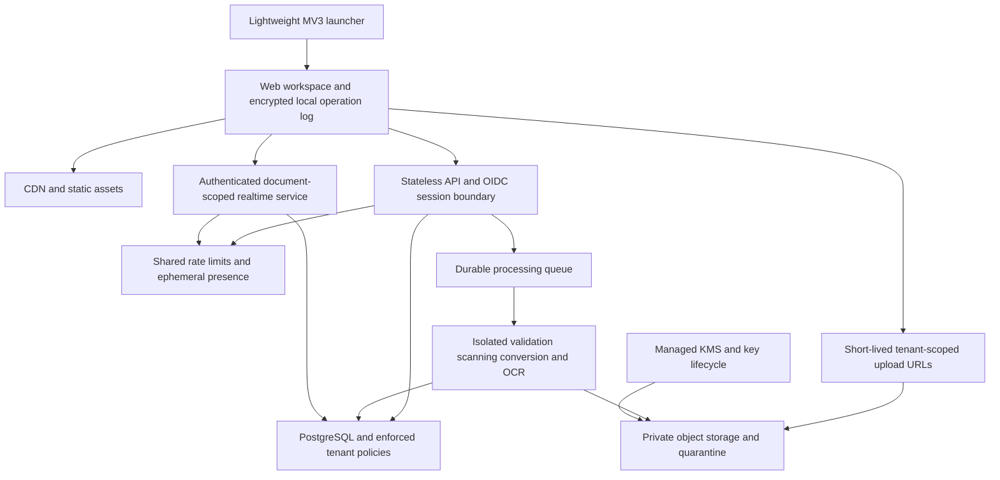

# Margin architecture

Margin is an original, runnable document workspace with an encrypted local vault, a worker-based PDF editor, a lightweight Chrome launcher and an optional encrypted upload API. The current implementation is a local development foundation. The production topology below is a proposed next stage, not evidence of 100,000-user capacity or production readiness.

## Implemented boundaries

| Component          | Current responsibility                                                                                           | Boundary                                                                                            |
| ------------------ | ---------------------------------------------------------------------------------------------------------------- | --------------------------------------------------------------------------------------------------- |
| Web application    | React/TypeScript workspace, document library, local teacher/student workflows and settings                       | One local vault is one local identity; role selection does not grant school permissions             |
| Browser vault      | Encrypted documents, metadata, annotation operations, assignments, settings and upload receipts in IndexedDB     | Bound to this browser profile and HTTPS origin; no cloud recovery or storage-retention guarantee    |
| Document engine    | PDF.js worker rendering; import and PDF editing/export workers; separate annotation operations                   | Browser workers keep compute off the UI thread but are not hardened process sandboxes               |
| Optional local API | HTTPS, authenticated resumable uploads, encrypted filesystem storage, owner isolation, quotas and quarantine     | Single process on loopback; no managed identity, scanner, object store or remote annotation service |
| Chrome extension   | Manifest V3 popup/service worker and explicit HTTPS source-link handoff                                          | No content scripts, host permissions, document processing, credentials or Google/LMS integration    |
| Database proposal  | Organization, classroom, document, operation, upload, integration, audit and policy schema in `infra/schema.sql` | Not connected to the local application or API                                                       |

## Browser encryption and editing lifecycle

The vault uses Web Crypto PBKDF2-HMAC-SHA256 with 600,000 iterations and a random salt to derive a non-exportable AES-256-GCM key. A passphrase has a minimum length of 12 characters and is never saved or sent to the API. Random nonces and authenticated vault/store/record bindings protect content and metadata against modification or record substitution. The unlocked key is held in memory. Public configuration holds derivation parameters, an encrypted verifier and a revision counter; it does not contain the passphrase or document content. See [the local security model](LOCAL_SECURITY.md) for configuration and threat boundaries.

An annotation changes the UI immediately, enters the local operation queue, and is encrypted and committed to IndexedDB. The save indicator changes to saved only after persistence completes. A failed save retains pending operations in memory and exposes retry; closing the editor attempts to flush first. Page edits atomically replace the PDF bytes, metadata and remapped annotations. Undo/redo includes page operations and retains at most 40 in-session entries. Older page revisions are evicted toward a 96 MB retained-blob budget; the newest undo entry is retained even if its PDF blobs exceed that budget. A crash before an encrypted commit can still lose pending in-memory changes.

A document-specific Web Lock prevents two local tabs from independently editing the same PDF. A second editor is read-only until it reloads and acquires the lock. This is single-writer coordination, not collaborative editing. Manual vault locking uses a cross-tab prepare/flush/commit handshake. Editor input freezes during preparation; pending text/drawing drafts, an active PDF operation, failed persistence or a timeout prevent a successful manual lock. Successful locking removes keys from memory and returns tabs to the passphrase gate. Forced browser/database termination remains a distinct failure boundary.

Import and export file limits are currently 100 MB in the web application. Exports contain annotated PDF data inside authenticated, encrypted `.margin` packages, including encrypted filename/media-type metadata. Download filenames use a generic timestamp. Extracting a page also produces an encrypted package and retains its complete comment appendix. Reopening in another vault requires the original export passphrase. There is no plaintext PDF download control or passphrase-reset service.

New HTTPS vault storage does not migrate or erase plaintext data created by an older prototype on an HTTP origin. Original source files outside the application also remain outside vault encryption. Browser code must decrypt content to render and edit it; a compromised unlocked browser or first-party script can access that content. Encryption at rest does not remove this execution-environment risk.

## Rendering and document operations

The editor renders one current-page canvas and at most five nearby thumbnail canvases. The active canvas is capped at 12 million backing pixels; each thumbnail is capped at 150,000. Render tasks are cancelled when superseded, PDF page resources are cleaned after rendering, and distant pages do not retain canvases. These are explicit render limits, not a measured total browser-heap guarantee.

PDF.js handles parsing/rendering in its own worker. Separate module workers perform import conversion and structural operations: rotation, duplication, blank-page insertion, deletion, reordering, merging and extraction. Annotation export encoding also runs in a worker before the result is encrypted. Supported editor tools include text, pen, area highlight, eraser, comments, rectangle, ellipse and line. Export flattens annotations into the PDF; text unsupported by the built-in PDF font is rasterized in the worker and is not selectable text in that export. Search reads selectable PDF text progressively; page-text viewing and browser speech support reading workflows. Scanned-page OCR and direct replacement of existing PDF text are not implemented.

The Chromium regression suite imports a synthetic 500-page PDF, verifies its page count, asserts no more than six canvases, navigates through pages 499 and 500 and reads text from the final page. This establishes bounded render-surface behavior for that fixture. It does not establish image-heavy PDF limits, Chromebook latency, heap stability, or long-session performance.

## HTTPS and local credentials

`npm run setup:dev` provisions a 30-day self-signed localhost certificate and permission-restricted configuration under `.local/`. Web development uses `https://127.0.0.1:5173`; the optional API binds to loopback on port 4100. TLS 1.2 is the minimum; TLS 1.3 is negotiated when available. Vite trusts the configured certificate as its API CA. Application HTTP is disabled. The test-only plaintext API fixture requires both test mode and an explicit opt-in; the application entry point does not expose it.

The API requires a separately configured bearer token, master encryption key and TLS key/certificate files. It does not generate or print a discoverable token. The configured local identity expires one hour after startup. The web UI keeps a pasted token in memory only and drops it on refresh or lock. Identity maps to a fixed tenant and user on the server; upload fields cannot select an owner or role. These controls remain developer authentication, not OIDC, MFA, school SSO or a production session lifecycle.

The extension accepts HTTPS workspace and source URLs only. It rejects credentials, source queries/fragments and privileged/file URLs. It transfers a user-selected source link rather than reading page content. Its permissions are limited to `activeTab`, `contextMenus` and `storage`. Native Chrome installation and school-managed deployment remain separate verification work.

## Upload protocol and server storage

Every protected request uses an explicit bearer header. CORS accepts the configured HTTPS development origins. The API supports PDF, PNG, JPEG and WebP up to 128 MiB; the browser's stricter import/export limit still applies to its workflow.

1. `POST /api/uploads` validates filename/media-type pairing, size and chunk bounds, reserves user quota, and returns an upload session. `Idempotency-Key` supports replayable creation.
2. `PUT /api/uploads/:id/chunks/:index` checks exact length and `X-Chunk-SHA256`. Identical retries are idempotent; conflicting content returns 409.
3. `GET /api/uploads/:id` returns acknowledged chunks for resume. The browser encrypts local receipts, uploads missing chunks, and supports retry, pause, resume and cancellation. Reopening requires an unlocked vault and a current in-memory API token.
4. `POST /api/uploads/:id/finalize` verifies chunks and the full checksum, validates the format signature, writes encrypted document parts and a manifest, and returns its security state. No plaintext assembled file is written.
5. Owner-scoped list/content/delete routes enforce tenant and user identity. Content is available only for a document approved by the trusted inspection boundary. `DELETE /api/uploads/:id` cancels an unfinished session.

Server storage uses AES-256-GCM envelope encryption with fresh data keys and authenticated object-path/generation bindings. Encrypted chunks/manifests and separately wrapped-key sidecars protect document bytes and identifying metadata. The included local key provider uses a separately provisioned master key; it is not a cloud KMS. Paths contain generated identifiers and hashed tenant/user namespaces. See [backend security](security-backend.md) for envelope details, limits, retention and operational controls.

The application entry point has no malware scanner or isolated structure validator. **Every finalized server upload remains quarantined, and download is blocked.** Successful upload means encrypted storage and integrity checks completed, not that the document is safe to render or distribute. Trusted synthetic scanner adapters are used only in tests. Browser imports are a separate local workflow and are not protected by this server quarantine gate.

Current safeguards include process-local request limits, eight concurrent API requests, 25 active uploads per user, a 512 MiB logical storage reservation limit, and 250 document manifests per user. Sessions expire after 24 hours; later upload creation cleans expired sessions. Documents have a default 30-day access-retention limit and an authenticated deletion route. Physical removal of idle expired documents, orphan key-sidecar cleanup and distributed enforcement still require production services.

Optional server upload transfers the stored source PDF over TLS, including saved structural page edits. It does not synchronize the separate annotation/comment operation log. The API decrypts/authenticates content in its process and encrypts it with its own key hierarchy: this is not end-to-end encryption against the server operator. An encrypted browser export and a quarantined server copy are distinct artifacts and durability boundaries.

## Intended production topology

Begin with a modular API and separately scaled processing/realtime workers. Private multipart object uploads should use narrowly scoped, expiring URLs. Persist upload receipts and finalize transitions transactionally; an outbox should bridge database commits to a durable queue. Restrict document workers with actual process/container CPU, memory, time and network limits. Define capacity in concurrent requests, connections, documents and bytes, rather than treating registered users as a throughput metric.

Production collaboration needs authenticated document grants, CRDT or validated conflict semantics, durable acknowledgments, replay cursors, snapshots and compaction. OIDC/SSO, document/class permissions, private object policies and runtime database roles must enforce identity throughout. `infra/schema.sql` proposes composite tenant foreign keys and restrictive RLS, but the application does not use it. Its SQL identity context must come from trusted authorization code; context variables do not authenticate a user.

Proposed availability and latency targets are unmeasured. Production observability must cover upload retries, quarantine/worker outcomes, render and memory behavior, operation acknowledgment lag and reconnect recovery while excluding document text, credentials and unrelated student activity. See [production readiness](PRODUCTION_READINESS.md) for the remaining release gates.
